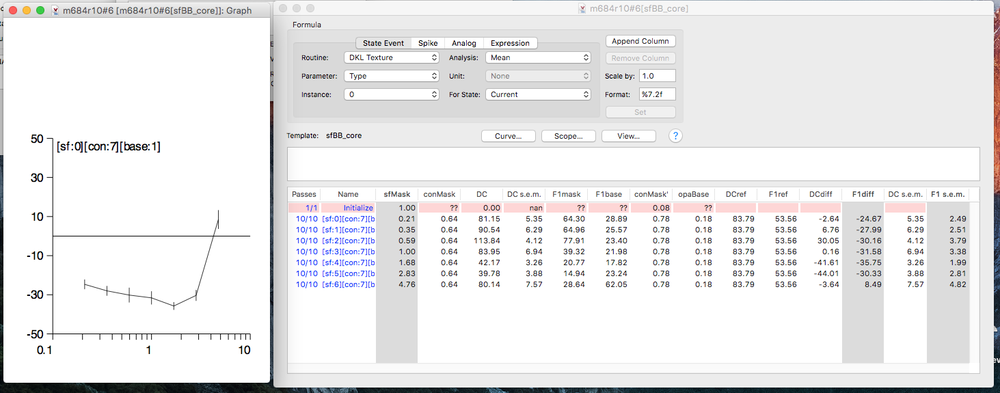
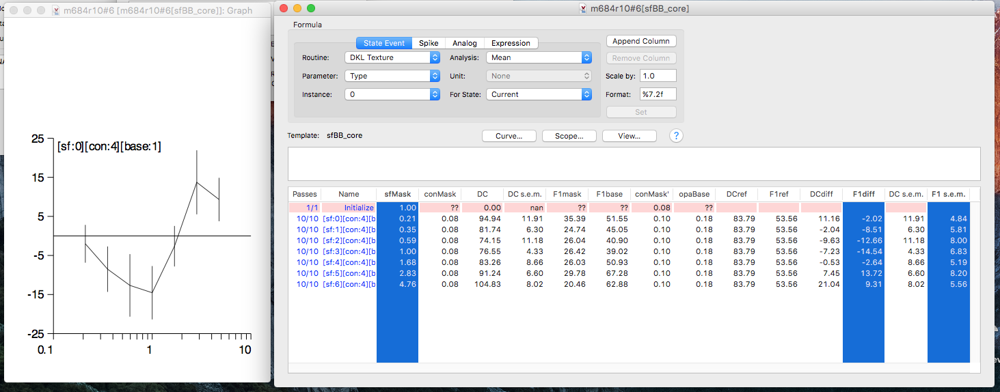

# Analyzing sfBB_* experiments in Expo
Use this guide to quickly analyze the results of the sfBB_* experiments in Expo. You can quickly look at tuning for spatial frequency, contrast, and even analyze
the effect of the mask stimuli (which fill out a 7x7 matrix of SF and CON values) on the base response (at fixed SF, CON).
You can probably use this guide just by looking at the pictures, but read the text if you want more detail.

### Expo analysis template
Be sure to load the corresponding template for the given sfBB_* experiment. That is, sfBB_core, sfBB_varSF, sfBB_varBase, as needed. 
This guide will just cover analyzing sfBB_core, but analyzing sfBB_var* is exactly the same, except you must also choose a "base" condition value.  

First, here's the analysis window once you use cmd+E to analyze the data. You can access the different conditions (sf/con/base) by pressing "View..."

 

### Spatial frequency tuning

Here's how to plot SF tuning curves, first at high contrast (you can see conMask=0.64) and a lower contrast (conMask=0.16), using the DC response.
Note that since we are just analyzing the mask response, we've set "base" to 0, meaning without the base stimulus presented.

  

Now, we can plot the same one of the above curves (lower mask contrast), but analyzing the F1 response - and again, since this is the mask response, we select the F1mask column.

### Response versus contrast (RVC)

You can also analyze the RVC by selecting "all" for contrast, and choosing a given SF value (here, we choose SF=2, a low SF value for which this cell was responsive)

### Analyzing the influence of the mask stimuli on the base response

You won't need to look at the response to the base stimulus directly, but instead we will measure the change in the base response in the presence of the mask.
Expo does this by taking the average response to the base stimulus alone (captured in DCref or F1ref; this fills out 7 conditions in the matrix, meaning 70 repeats) and
then subtracting that response from the response in the presence of the mask & base together (ensure that base=1, now, in "View...").

It's easiest to understand the F1 response, since we can measure the response just at the base TF alone - in principle, the mask stimulus will not influence the response
at the base TF unless the cell is experiencing saturation/gain control. In the below plot, we can see that the base response is suppressed (i.e. less than zero) for all but the
highest SF. There is some shaping to this curve, with the strongest suppression at frequencies between 1 and 3 cpd - this hints at a frequency 
dependence in the gain control. The mask here is at 64% contrast.

At a lower mask contrast (8%), there is still some influence of the mask stimulus on the base response, but the magnitude is greatly reduced from when the mask contrast was higher.
At still lower mask contrasts, this deviation from the base-alone response is likely to disapper. For some cells, there is never a systematic deviation, even at high
mask contrasts - these are cells that do not show much gain control.

As for analyzing the effect of DC responses, it is more complicated - you cannot separate the response attributable to the mask vs. base stimuli. For this particular cell,
it's quite easy to see the influence, nonetheless. At high mask contrast, the response is enhanced for mask frequencies near the cell's preferred, but actually suppressed below 
baseline (hence less than 0) for higher SF. 

At low contrast, again the magnitude and lawfulness of the change in response is reduced.

### A cell that _isn't_ showing gain control effects
Just for reference, unlike the cell I showed above, here is an example that doesn't show any gain control.
The DC response is elevated above the base only response for all SF here, at high contrast. Further, the shape is identical to the mask only tuning curve.
As in the above difference plots, in "View...", be sure that base is set to 1 (base on).

Then, for the F1 response - where it should be easier to distinguish the influence of the mask stimulus - there is little deviation in the base response
in the presence of the mask.

